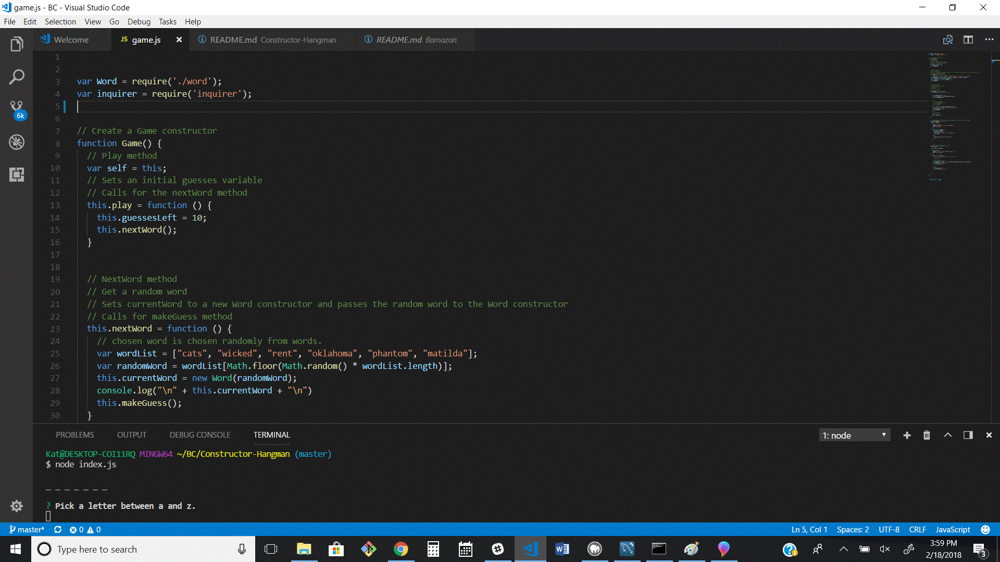
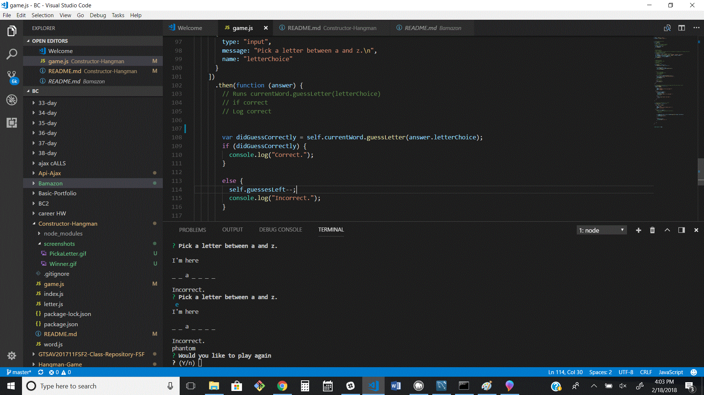
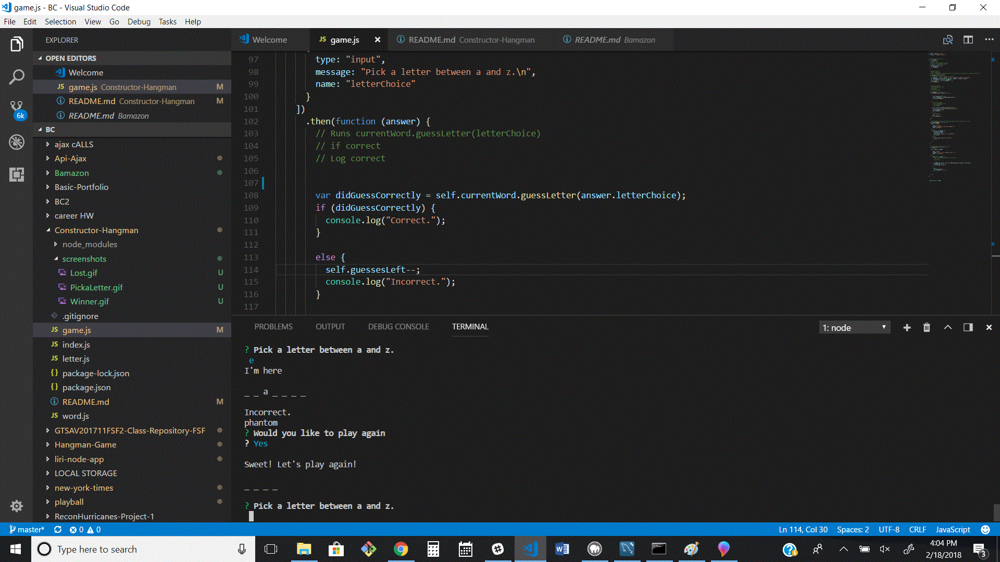
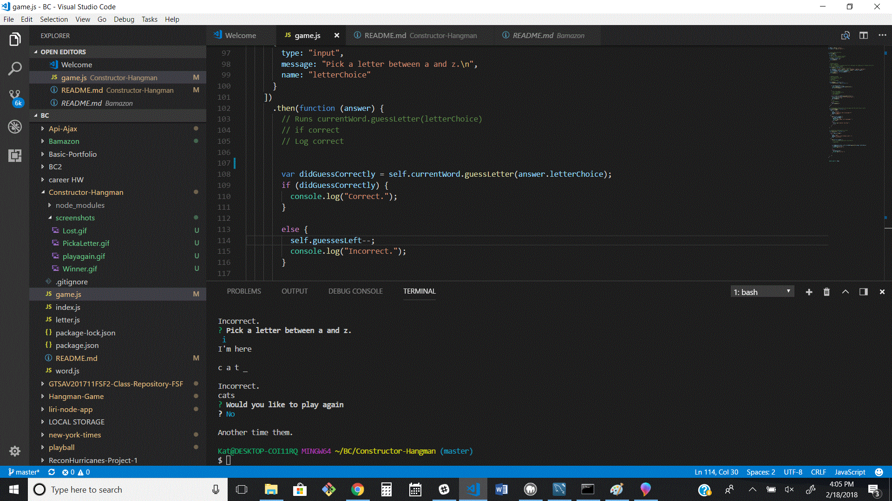

# Constructor-Hangman
Instructions

A hangman game run in node

once app runs - user is prompted to pick a letter - user has 10 guesses - with each turn the app prompts the user to pick another letter.

if the word is guessed a new game begins with a new word

if the word is not guessed the app asks the user if they wish to play agian

if the user responds yes the app runs a new game with a new word.

if the users responds no the app exits the game

